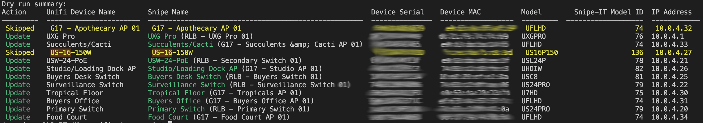

# UniFi to Snipe-IT

This project is a Python script that synchronizes UniFi devices with Snipe-IT. It fetches devices from a UniFi controller, formats them, and adds or updates them in Snipe-IT. The script can also create new models in Snipe-IT if they don't already exist.

## Features

*   Fetch devices from UniFi controller
*   Fetch existing UniFi devices from Snipe-IT
*   Create new models in Snipe-IT if they don't already exist
*   Add or update devices in Snipe-IT based on their serial numbers.
*   Dry run mode to preview changes without modifying Snipe-IT

## Requirements

*   Python 3.6 or higher
*   `requests` library
*   `ratelimiter` library
*   `tabulate` library
*   `pyunifi` library
*   `termcolor` libary

These can all be installed using requirements.txt discribed in the steps below.

## Installation


1.  Clone the repository or download the source code.

```bash
`git clone https://github.com/yourusername/unifi-to-snipeit.git cd unifi-to-snipeit`
```

2.  Install the required libraries.

```bash
pip3 install -r requirements.txt

```

3.  Copy `config_example.ini` to `config.ini` and update the configuration settings with your UniFi and Snipe-IT credentials and preferences.

```bash
cp config_example.ini config.ini
```

## Prep Work In Snipe
There are a few thigns to take care of in Snipe-IT before you start the configuration

1. Get an API Key
2. Create a manufacturer of Ubuiquiti (if you have not already, or choose a default manufacturer)
3. Create a Networking Asset Category (if you have not already, or choose a default asset category)
4. Make sure the fieldset you are using has a ip address custom field
5. Make sure the fieldset you are using has a mac address custom field


## Configuration


Update the `config.ini` file with your UniFi controller and Snipe-IT API credentials and preferences. The following sections are available for configuration:

*   `[UniFi]`: UniFi controller settings (URL, username, password, port, version, and site ID)
*   `[SnipeIT]`: Snipe-IT API settings (API URL, API key, manufacturer, model category ID, MAC address field name, IP address feild name, default status ID, device name priority, and rate limit)
*   `[unifi_model_mapping]`: UniFi model mapping for converting UniFi model names to Snipe-IT model names

### Model Mapping
Ubuiquiti has had some "fun" with their model numbers. When origionally adding our Unifi devices into Snipe-IT, we used the model numbers shown of the devices detail page in the control panel. However, the API returns a completly different set of model numbers for devices. The unifi_model_mapping allows you to map the API model numbers to existing models numbers you might have set in Snipe-IT already.

### PyUnifi
We used the PyUnifi libary to interact with the Unifi API. You might want to read through their docs to debug your particular connection. We included a unifi.py file where you can test your settings. https://github.com/finish06/pyunifi


## Usage


To run the script, execute the following command:

```bash
python main.py
```



To perform a dry run without making changes to Snipe-IT, use the `--dry-run` option:

```bash
python main.py --dry-run
```

During the dry run, the script will output a summary of the changes that would be made to Snipe-IT.

To override the `site_id` specified in the config file, use the `--site-id` option followed by the new site ID:

```bash
python main.py --site-id new_site_id
```
This is useful if your unifi controler has more than one site. There is not currently support for more than one controler. If you have multible controlers we recommend setting up another instance of the script with a different config file.

Contributing
------------

Please feel free to open issues or submit pull requests with bug fixes or improvements. Your contributions are welcome and appreciated.

License
-------

This project is licensed under the MIT License. See the [LICENSE](LICENSE) file for more information.
